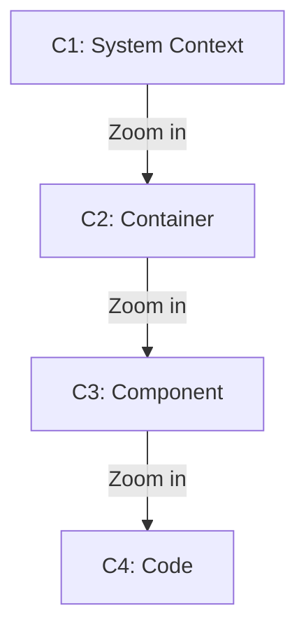

# C4 Model Architecture Diagrams

> **STUB: This skill is not yet implemented**
>
> This placeholder preserves the documented plugin structure.
> See parent plugin README for planned capabilities.

## Planned Capabilities

**C4 Model Hierarchy**:

- **C1 System Context**: High-level system boundaries and external actors
- **C2 Container**: Applications, data stores, microservices
- **C3 Component**: Internal structure of containers
- **C4 Code**: Class/module level detail (optional)
- Structurizr DSL integration
- PlantUML C4 extension support

## Implementation Status

- [ ] Core implementation
- [ ] References documentation
- [ ] Output templates
- [ ] Integration tests
