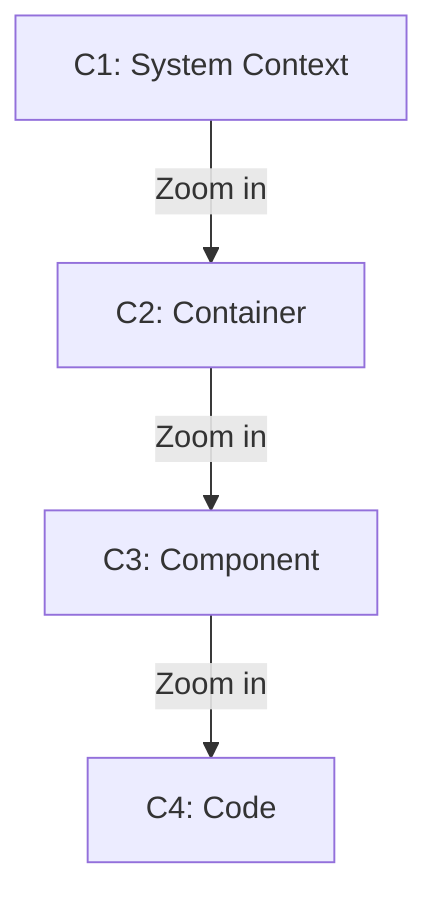
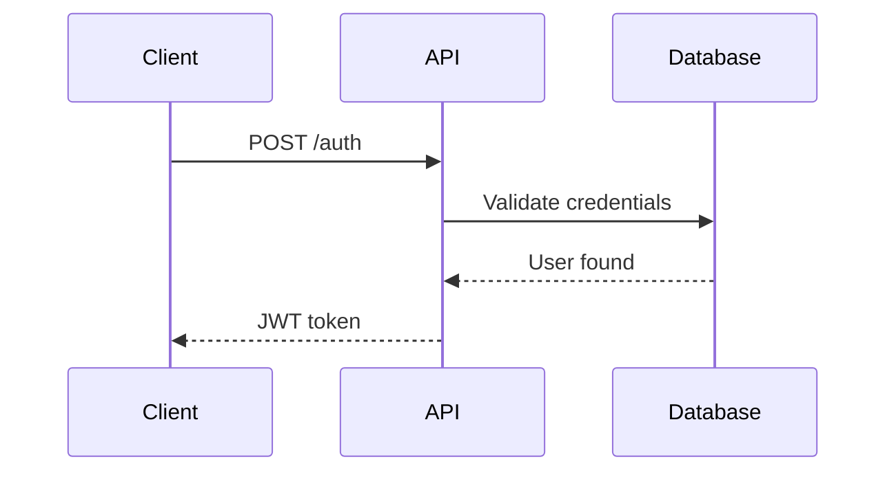

# agentient-architecture-design

System architecture design and documentation using C4 model, OpenAPI 3.1.0, Mermaid.js diagrams-as-code, and Architectural Decision Records.

**Confidence**: 99% | **Category**: Cross-Cutting | **Version**: 1.0.0

## Key Features

- **C4 Model**: Context, Container, Component, Code diagrams for layered architecture visualization
- **Design-First APIs**: OpenAPI 3.1.0 specs as single source of truth
- **Diagrams-as-Code**: Mermaid.js for version-controlled, reviewable visual documentation
- **ADRs**: Lightweight architectural decision tracking in Markdown
- **Anti-Doc-Rot**: Plain text, version-controlled, integrated into CI/CD

## Core Patterns

### 1. C4 Model Hierarchy


### 2. OpenAPI 3.1.0 Design-First
```yaml
openapi: 3.1.0
info:
  title: User API
  version: 1.0.0
paths:
  /users:
    get:
      summary: List users
      responses:
        '200':
          description: Success
          content:
            application/json:
              schema:
                type: array
                items:
                  $ref: '#/components/schemas/User'
```

### 3. Mermaid Sequence Diagram


### 4. Architectural Decision Record (ADR)
```markdown
# ADR-001: Use PostgreSQL for Primary Database

## Status
Accepted

## Context
Need scalable relational database with ACID guarantees

## Decision
Use PostgreSQL 15+ for primary data storage

## Consequences
+ Strong ACID compliance
+ Rich ecosystem
- Higher operational complexity than NoSQL
```

## Components

- **Agent**: architect-agent
- **Commands**: /create-c4-diagram, /design-api-spec, /create-sequence-diagram, /create-adr
- **Skills** (6): C4 model, OpenAPI design, Mermaid DaC, sequence diagrams, ER diagrams, ADRs

## Anti-Patterns

❌ Binary diagram tools (Visio, draw.io files)
❌ API implementation before specification
❌ Diagrams in separate documentation systems
✅ Plain text, version-controlled, embedded in code

---

**Generated with Claude Code** | Version 1.0.0
